# 高聖倫 <span style="color:red">(106061851)</span>

# Project 3 / Scene recognition with bag of words

## Overview
The project is related to 
> The goal of this project is to introduce image recognition. Specifically, we will examine the task of scene recognition starting with very simple methods: **tiny_image** and **nearest_neighbor**, and then move on to techniques: **bag_of_sift** and linear classifiers learned by **support_vector_machine**. Also, we combine both and compare the consequent accuracy.


## Implementation
### Image representation
- 1. tiny-image feature: 
- get_tiny_images.py:
    * Resize each image to (16,16) and then flatten to a vector of 256 (length)
    * Normalize the vector to the zero mean and unit length
	```python
		N = len(image_paths)
		tiny_images = np.zeros((N,256))
		for i in range(N):
			img = Image.open(image_paths[i])
			img = img.resize((16,16))
			image_resize = np.asarray(img, dtype='float32').reshape(256,).flatten()
			tiny_images[i,:] = (image_resize-np.mean(image_resize))/np.std(image_resize)
	```

- 2. Bags-of-sifts feature:
- build_vocabulary.py:
    * Build up the vocabulary for training and testing dataset
    * Use `dsift` to sample descriptors and cluster them to the center with `kmeans` algorithm
	```python 
		bag_of_features = []
		print("Extract SIFT features")
		for path in image_paths:
			img = np.asarray(Image.open(path),dtype='float32')
			frames, descriptors = dsift(img, step=[5,5], fast=True)
			bag_of_features.append(descriptors)
		bag_of_features = np.concatenate(bag_of_features, axis=0).astype('float32')
		print("Compute vocab")
		start_time = time()
		vocab = kmeans(bag_of_features, vocab_size, initialization="PLUSPLUS")    
	```


- get_bags_of_sifts.py:
    * Open the `vocab.pkl` built in `build_vocabulary.py`
    * Extract descriptors using `dsift` for each image [step=(5,5)]
    * Calculate the distance of vocabulary and descriptors using `cdist`
    * Choose the minimum distance for each descriptor and build the histogram 
	```python
		with open("vocab.pkl", "rb") as gg:
			voc = pickle.load(gg)
			image_feats = np.zeros((len(image_paths),len(voc)))    
		for i in range(len(image_paths)):
			img = np.asarray(Image.open(image_paths[i]) , dtype='float32')
			_ , descriptors = dsift(img, step=[5,5], fast=True)
			dist = distance.cdist(voc, descriptors, 'euclidean')
			choose = np.argmin(dist, axis=0)
			for vote in choose:
				image_feats[i,vote] += 1    
	```

### Classifier
- 1. KNN
- nearest_neighbor_classify.py:
    * Find the first k nearest distance from each testing feature to training features  
    * Count each unique label to vote for the most possible prediction
	```python
		k=1    
		[N,d] = train_image_feats.shape
		M = test_image_feats.shape[0]
		train_labels = np.array(train_labels)
		test_predicts = []
		
		dist = distance.cdist(train_image_feats,test_image_feats,'euclidean')
		knn = np.argsort(dist,axis=0)
		for i in range(M):  
			labels_unique,counts = np.unique(train_labels[knn[0:k,i]],return_counts = True)
			test_predicts.append(labels_unique[np.argmax(counts)])
	```

- 2. linear SVM
- svm_classify.py:
    * Using `LinearSVC` model with C = 0.0001 to predict the output labels
	```python
		mdl = LinearSVC(C= 0.0001)
		#mdl = svm.SVC(C= 1, kernel='poly')
    	#mdl = linear_model.SGDClassifier()
		mdl.fit(train_image_feats, train_labels)
		pred_label = mdl.predict(test_image_feats)   
	```

	
## Installation
- Other required packages 
    * Required packages: scipy, numpy, matplotlib, os, cyvlfeat
- How to run your code? 
    * run proj3.py at folder"code", you can comment&uncomment in row 56 to 62 to change setting, then you can see the result.

	
## Results (**FEATURE**  x  **CLASSIFIER** : Accuracy)
- The Accuracy of combining FEATURE and CLASSIFIER results are shown below.
    * **args.feature**  x  **args.classifier** : 0.0673, when vocab_size=400.
    * **tiny_image**  x  **nearest_neighbor** : 0.2173, when vocab_size=400.
    * **bag_of_sift**  x  **nearest_neighbor** : 0.5293, when vocab_size=400.
    * **bag_of_sift**  x  **support_vector_machine** : 0.6826, when vocab_size=400.
    * **bag_of_sift**  x  **support_vector_machine** : 0.721, when vocab_size=1000.
    * **bag_of_sift**  x  **support_vector_machine** : 0.7253, when vocab_size=10000.

	
### Normalized confusion matrix
- The Normalized confusion matrix results are shown below.

	|**args.feature**  x  **args.classifier** (Accuracy = 0.0673)|**tiny_image**  x  **nearest_neighbor** (Accuracy = 0.2173)|
	|:---:|:---:|
	| vocab_size=400 | vocab_size=400 |
	|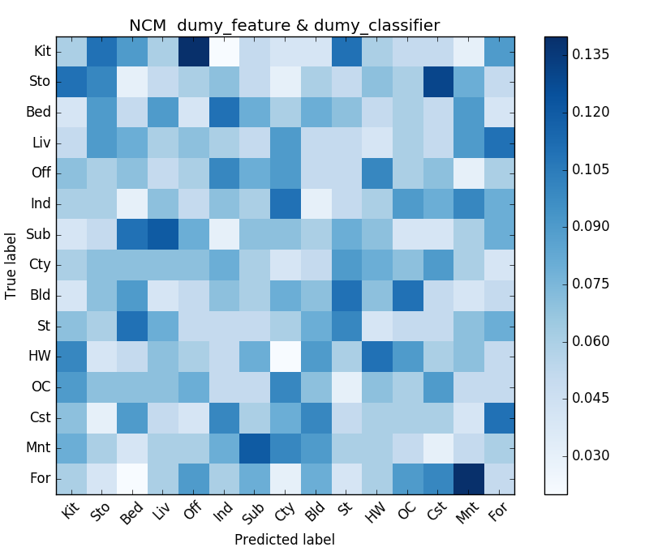|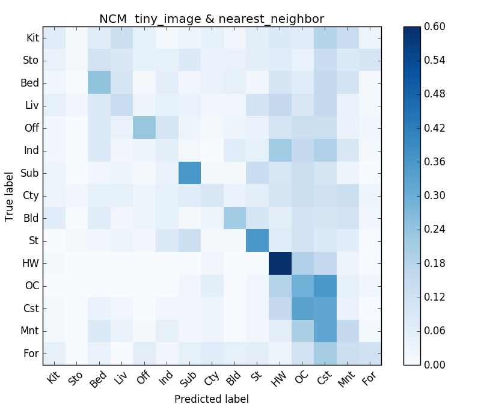|

	|**bag_of_sift**  x  **nearest_neighbor** (Accuracy = 0.5293)|**bag_of_sift**  x  **support_vector_machine** (Accuracy = 0.6826)|
	|:---:|:---:|
	| vocab_size=400 | vocab_size=400 |
	|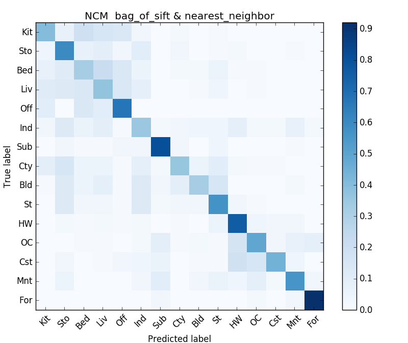|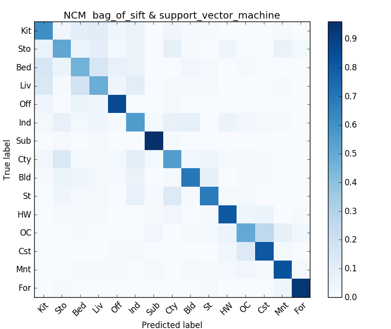|
	
	|**bag_of_sift**  x  **support_vector_machine** (Accuracy = 0.721)|**bag_of_sift**  x  **support_vector_machine** (Accuracy = 0.7253)|
	|:---:|:---:|
	| vocab_size=1000 | vocab_size=10000 |
	|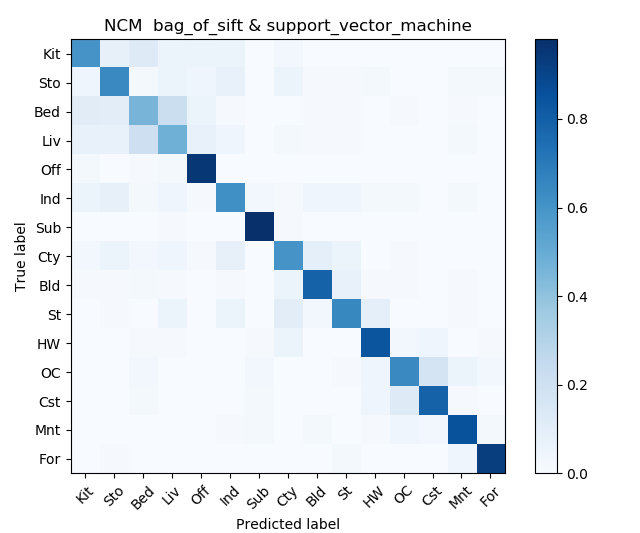|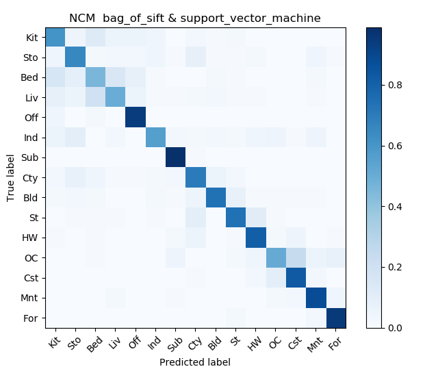|
	
###  [Extra credit] Experiment with many different vocabulary sizes and report performance
- **bag_of_sift**  x  **support_vector_machine** with many different vocabulary sizes performance result is shown below.

| vocab_size | C(LinearSVC) | Accuracy |
| :-----------: | :-------------------: | :-----------------------------: |
| 10 | 0.0001 | 0.422 |
| 20 | 0.0001 | 0.514 |
| 50 | 0.0001 | 0.62 |
| 100 | 0.0001 | 0.6486 |
| 200 | 0.0001 | 0.684 |
| 400 | 0.0001 | 0.6826 |
| 1000 | 0.0001 | 0.721 |
| 10000 | 0.0001 | 0.7253 |


## Visualization
- The Visualization result[ **bag_of_sift**  x  **support_vector_machine** : 0.7253, when vocab_size=10000 ] is shown below.

| Category name | Accuracy | Sample training images | Sample true positives | False positives with true label | False negatives with wrong predicted label |
| :-----------: | :--------------------: | :-------------------: | :-----------------------------: | :----------------------------------------: | :----------------------------------------: |
| Kitchen | 0.61 |  |  |  | 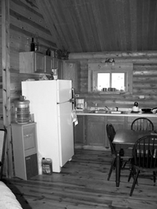 |
| Store | 0.66 |  |  |  |  |
| Bedroom | 0.46 | 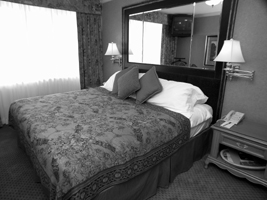 | 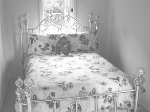 |  |  |
| LivingRoom | 0.5 |  |  |  | 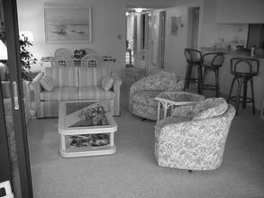 |
| Office | 0.94 |  |  | 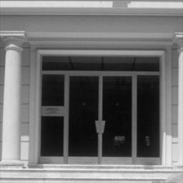 |  |
| Industrial | 0.56 |  | 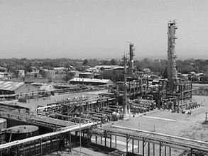 |  |  |
| Suburb | 0.99 | 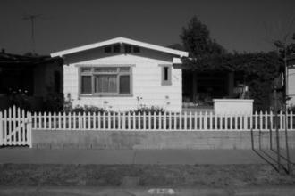 |  |  | 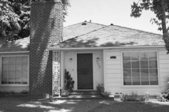 |
| InsideCity | 0.7 |  |  |  | 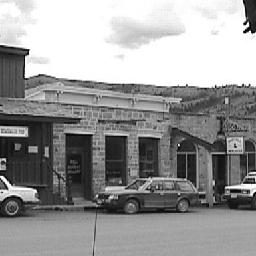 |
| TallBuilding | 0.74 |  |  | 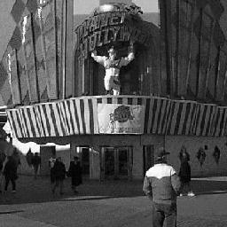 |  |
| Street | 0.74 |  |  |  |  |
| Highway | 0.81 | 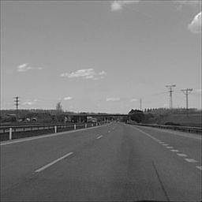 | 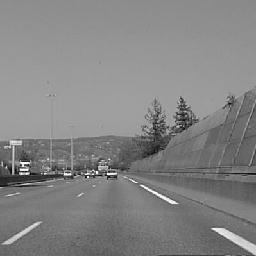 | 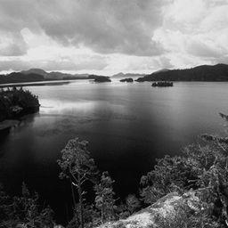 |  |
| OpenCountry | 0.51 |  |  |  |  |
| Coast | 0.83 |  |  | 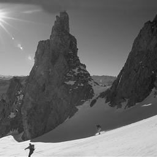 |  |
| Mountain | 0.88 |  | 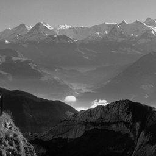 |  | 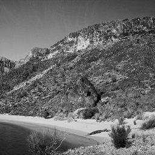 |
| Forest | 0.95 |  |  |  |  |
